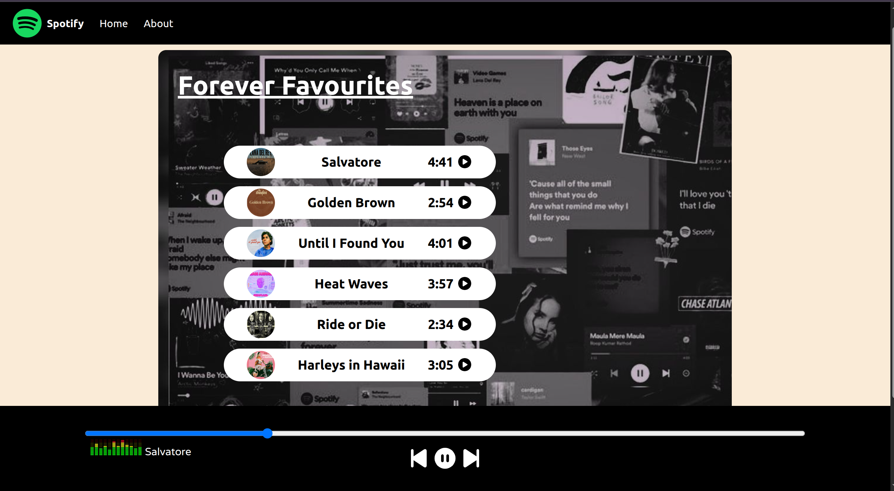

# 🎵 Spotify Clone - Music Player Web App

<div align="center">
  
</div>


---

# 📖 About The Project

A responsive **Spotify-inspired Music Player Web App** built using **HTML, CSS, and JavaScript**.
This project allows users to play, pause, switch songs, seek audio progress, and enjoy a modern music player interface inspired by Spotify.

The application dynamically loads songs, cover images, timestamps, and provides interactive playback controls.

---

# 🚀 Features

* 🎶 Play & Pause songs
* ⏭️ Next & Previous track controls
* 📀 Dynamic song list rendering
* 🎧 Live song name display
* 📈 Interactive progress bar
* 🎵 Animated playing GIF indicator
* 🖼️ Song cover images
* 📱 Responsive UI
* 🧭 Fixed navigation bar
* ⚡ Smooth and lightweight design

---

# 🛠️ Technologies Used

* **HTML5**
* **CSS3**
* **JavaScript (Vanilla JS)**
* **Font Awesome Icons**
* **Google Fonts**

---

# 📂 Project Structure

```bash
Spotify-Clone/
│
├── index.html
├── style.css
├── script.js
│
├── assets/
│   ├── Spotify_icon.svg.png
│   ├── playing.gif
│   ├── spotify-clone.png
│   │
│   ├── songs/
│   │   ├── 1.mp3
│   │   ├── 2.mp3
│   │   ├── 3.mp3
│   │   ├── 4.mp3
│   │   ├── 5.mp3
│   │   └── 6.mp3
│   │
│   └── cover/
│       ├── 1.jpg
│       ├── 2.jpg
│       ├── 3.jpg
│       ├── 4.jpg
│       ├── 5.jpg
│       ├── 6.jpg
│       └── bg.jpg
```

---

# 🎵 Songs Included

| Song              | Artist          |
| ----------------- | --------------- |
| Salvatore         | Lana Del Rey    |
| Golden Brown      | The Stranglers  |
| Until I Found You | Stephen Sanchez |
| Heat Waves        | Glass Animals   |
| Ride or Die       | Unknown         |
| Harleys in Hawaii | Katy Perry      |

---

# ⚙️ How It Works

## 1️⃣ Song Initialization

The songs are stored inside a JavaScript array containing:

* Song name
* Audio file path
* Cover image path
* Timestamp

```javascript
let songs = [
  {
    songName: "Salvatore",
    filePath: "./assets/songs/1.mp3",
    coverPath: "./assets/cover/1.jpg",
    timeStamp: "4:41",
  }
];
```

---

## 2️⃣ Dynamic Song Rendering

JavaScript dynamically updates:

* Song names
* Cover images
* Timestamps

inside the HTML UI.

---

## 3️⃣ Audio Playback Controls

Users can:

* Play songs
* Pause songs
* Skip forward
* Go back

using event listeners.

---

## 4️⃣ Progress Bar Sync

The progress bar updates automatically as the song plays.

```javascript
audioElement.addEventListener("timeupdate", () => {
  let progress = parseInt(
    (audioElement.currentTime / audioElement.duration) * 100
  );

  myProgressBar.value = progress;
});
```

---

# 💻 Installation & Setup

## Clone the repository

```bash
git clone https://github.com/your-username/spotify-clone.git
```

## Open the project

Simply open:

```bash
index.html
```

in your browser.

---

# 📸 UI Highlights

* Spotify-inspired layout
* Black & white modern theme
* Rounded song cards
* Sticky music player
* Smooth icon interactions

---

# 🔥 Future Improvements

* 🔊 Volume control
* ❤️ Favorite songs feature
* 📃 Playlist support
* 🌙 Dark mode toggle
* 📱 Better mobile responsiveness
* 🎼 Music visualizer
* 🔀 Shuffle & repeat functionality

---

# 🧠 Learning Outcomes

This project helps in understanding:

* DOM Manipulation
* Event Handling
* Audio API
* Responsive Design
* JavaScript Arrays & Objects
* Dynamic UI Updates

---

# 👩‍💻 Author

Made with ❤️ by **Amisha Patel**

---

# ⭐ Support

If you liked this project:

* Give it a ⭐ on GitHub
* Fork the repository
* Share it with others

---

